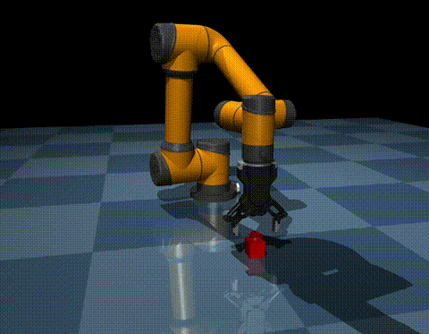
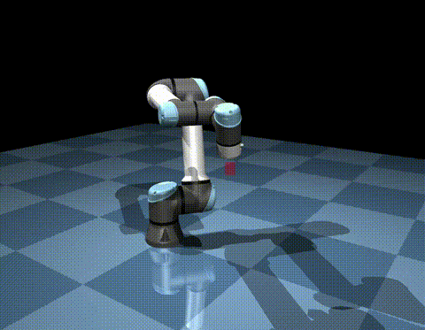

# Manipulator-Mujoco

<p float="left">


</p>

Manipulator-Mujoco is a template repository that simplifies the setup and control of manipulators in Mujoco. It provides a generic operational space controller that can work with any robot arm. It offers a Gymnasium base environment that can be tailored for reinforcement learning tasks. This repository is built with dm_control, providing effortless configuration for different Mujoco environments.

## Supported Robots

Currently, the following robot arms and grippers are supported in this repository:

### Robot Arms
1. Aubo i5
2. UR5e

### Grippers
1. DH Robotics AG95

## Installation

To get started, follow these steps to install the repository:

1. Clone this repository to your local machine:

   ```bash
   git clone https://github.com/ian-chuang/Manipulator-Mujoco.git
   ```

2. Navigate to the root directory of the repository:

   ```bash
   cd Manipulator-Mujoco
   ```

3. Install the repository in editable mode:

   ```bash
   pip install -e .
   ```

## Demos

Explore the capabilities of Manipulator-Mujoco with the provided demos located in the `/demo` folder:

### Aubo i5 Arm with AG95 Gripper

To run the demo for the Aubo i5 arm with the AG95 gripper, execute:

```bash
python aubo_i5_demo.py
```

### UR5e Arm

To run the demo for the UR5e arm, execute:

```bash
python ur5e_demo.py
```

In the demos, you can manipulate the arm by double-clicking and selecting the target red box mocap. Hold the Ctrl key and left-click and drag to rotate or Ctrl key and right-click and drag to translate. The arm will utilize operational space control to follow the target mocap.

## Setting Up Your Own Environment

If you want to create your own environment, follow the structure defined in `manipulator_mujoco/envs`. Here's a simplified example of how to set up an environment:

```python
# create checkerboard floor arena
self._arena = StandardArena()

# create mocap target that OSC will try to follow
self._target = Target(self._arena.mjcf_model)

# ur5e arm
self._arm = Arm(
    xml_path=os.path.join(
        os.path.dirname(__file__),
        '../assets/robots/ur5e/ur5e.xml',
    ),
    eef_site_name='eef_site',
    attachment_site_name='attachment_site'
)

# attach arm to arena
self._arena.attach(
    self._arm.mjcf_model, pos=[0, 0, 0], quat=[0.7071068, 0, 0, -0.7071068]
)

# generate model
self._physics = mjcf.Physics.from_mjcf_model(self._arena.mjcf_model)
```

Operational space control setup is designed to be straightforward:

```python
# set up OSC controller
self._controller = OperationalSpaceController(
    physics=self._physics,
    joints=self._arm.joints,
    eef_site=self._arm.eef_site,
    min_effort=-150.0,
    max_effort=150.0,
    kp=200,
    ko=200,
    kv=50,
    vmax_xyz=1.0,
    vmax_abg=2.0,
)
```

Before running `physics.step()`, simply calculate the target pose and run the OSC controller to move to the target pose:

```python
target_pose = calculate_target_pose_for_OSC()  # [x, y, z, qx, qy, qz, qw]

# run OSC controller to move to target pose
self._controller.run(target_pose)

# step physics
self._physics.step()
```

The OperationalSpaceController and Arm classes handle the details of tracking the mjcf element IDs, eliminating the need to specify joint names or actuator names. It should work seamlessly with any robot arm model, including various joint types, as long as the actuators are removed from the model since the controller automatically applies torques to each joint.

## Inspiration

This repository drew inspiration from the following repositories:

- [ARISE-Initiative/robosuite.git](https://github.com/ARISE-Initiative/robosuite.git)
- [ir-lab/irl_control.git](https://github.com/ir-lab/irl_control.git)
- [abr/abr_control.git](https://github.com/abr/abr_control.git)

Feel free to explore, experiment, and contribute to this repository as you work on your robotic manipulation tasks in Mujoco with operational space control.
